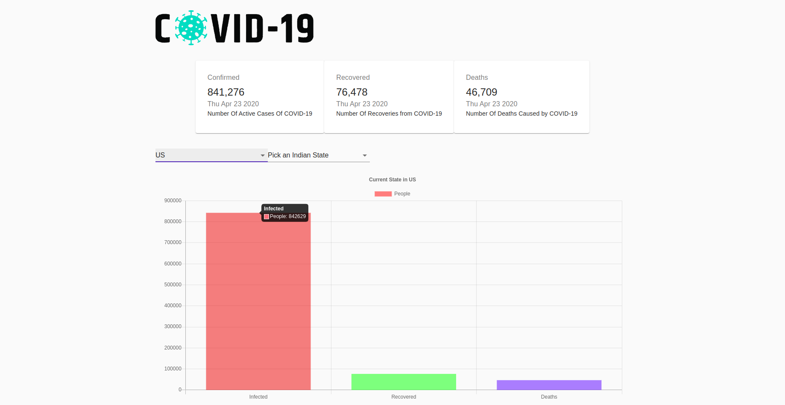

# COVID-19_Tracker
The following React app keeps a track of the present COVID-19 cases in the world and individual Countries.

## Steps to Run app
1. Clone the Repository.
2. Run npm install to install all dependencies.
3. Run npm start to Run the app.

